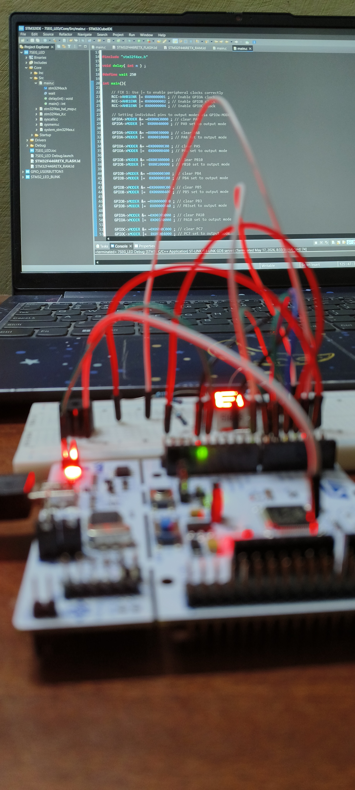
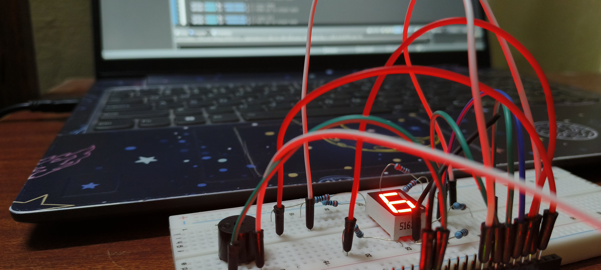

# STM32 7-Segment LED Interfacing

This project demonstrates interfacing a 7-segment display with an STM32F446RE Nucleo board using register-level programming (or HAL).

## Hardware Components
* STM32F446RE Nucleo-64
* 7-Segment Display (Common Anode/Cathode)
* Resistors (220 ohm)
* Breadboard and Jumper wires
* Buzzer ( i added just for fun )

## Setup
 

## Performance
<video controls src="video.mp4" title="working_video"></video>

## How to Run
1. Clone the repo.
2. Import into STM32CubeIDE.
3. Build and Flash to your Nucleo board.